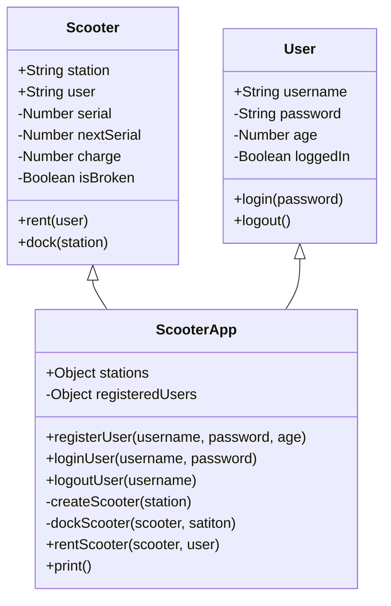

```mermaid
classDiagram

    Scooter <|-- ScooterApp
    User <|-- ScooterApp

  class Scooter {
    +String station
    +String user
    -Number serial
    -Number nextSerial
    -Number charge
    -Boolean isBroken
    +rent(user)
    +dock(station)
  }

  class User {
    +String username
    -String password
    -Number age
    -Boolean loggedIn
    +login(password)
    +logout()
  }

  class ScooterApp {
    +Object stations
    -Object registeredUsers
    +registerUser(username, password, age)
    +loginUser(username, password)
    +logoutUser(username)
    -createScooter(station)
    -dockScooter(scooter, satiton)
    +rentScooter(scooter, user)
    +print()
  }
```